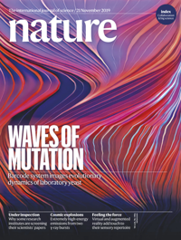
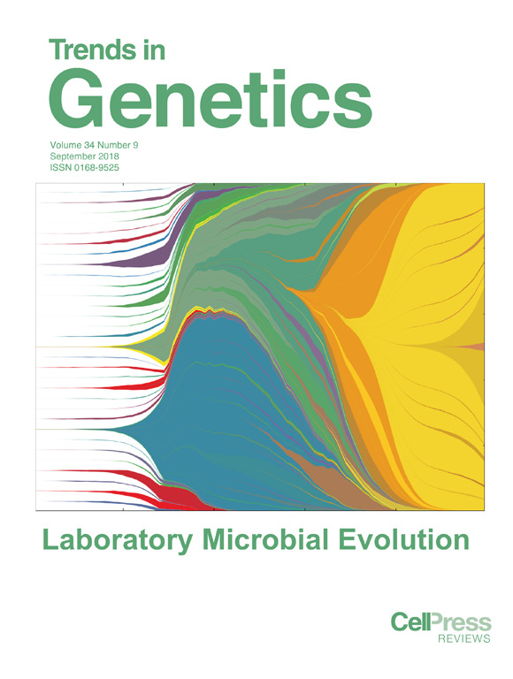

<ol>
	<li>Tung S, Bakerlee CW, Phillips A, <b>Nguyen Ba AN</b>, Desai MM:
		<b><b>The genetic basis of differential autodiploidization in evolving yeast populations.</b></b>
		<i>Submitted</i>. 2021.</li>
	
	<li><b>Nguyen Ba AN*</b>, Lawrence KR*, Rego-Costa A*, Gopalakrishnan S, Desai MM: 
<b><b>Barcoded Bulk QTL mapping reveals highly polygenic and epistatic architecture of complex traits in yeast.</b></b>
<i>Submitted</i>. 2020.</li>
	<li>Johnson MS, Gopalakrishnan S, Goyal J, Dillingham ME, Bakerlee CW, Humphrey PT, Jagdish T, Jerison ER, Kosheleva K, Lawrence KR, Min J, Moulana A, Phillips AM, Piper JC, Purkanti R, Rego-Costa A, McDonald MJ, <b>Nguyen Ba AN</b>, Desai MM: 
<b><b>Phenotypic and molecular evolution across 10,000 generations in laboratory budding yeast populations.</b></b>
<i>eLife</i>. 2021;10:e63910.</li>
	
	<li>Kuzmin E*, VanderSluis B*, <b>Nguyen Ba AN</b>, Wang Wen, Koch EN, Freisen H, Usaj M, Khmelinskii A, Usaj MM, van Leeuwen J, Kraus O, Tresenrider A, Pryszlak M, Hu M, Varriano B, Hanchaard J, Costanzo M, Caudy A, Unal E, Knop M, Moses AM, Myers CL, Andrews BJ, Boone C: 
<b><b>Exploring whole-genome duplicate gene retention with complex genetic interaction analysis.</b></b>
<i>Science</i>. 2020, Jun 26;368(6498):eaaz5667.</li>
	
	<li>Zulauf K*, Green A*, <b>Nguyen Ba AN</b>, Jagdish T, Reif D, Seeley R, Dale A, Kirby J: 
<b><b>Microwave-generated steam decontamination of N95 respirators utilizing universally accessible materials.</b></b>
<i>mBio</i>. 2020, Jun 25;11(3):e00997-20.</li>
	
	<li>Jerison ER, <b>Nguyen Ba AN</b>, Desai MM, Kryazhimskiy S: 
<b><b>Chance and necessity in the pleiotropic consequences of adaptation for budding yeast.</b></b>
<i>Nat. Ecol. Evol</i>. 2020, Apr;4(4):601-611.</li>

	<li>

<b>Nguyen Ba AN</b>*, Cvijovic I*, Rojas Echenique JI*, Lawrence KR, Rego-Costa A, Liu X, Levy S, Desai MM: 
<b><b>High-resolution lineage tracking reveals traveling wave of adaptation in laboratory yeast.</b></b>
<i>Nature</i>. 2019, Nov 13;575(7783):494-99.

</li>

	<li>Pham JY, Ogbunugafor CB, <b>Nguyen Ba AN</b>, Hartl DL: 
<b><b>Experimental evolution of bacteriophage T4 results in changes in phage productivity and structural genes.</b></b>
<i>Microbiologyopen</i>, 2019, Nov 28:e968.</li>

	<li>Zarin T, Strome B, <b>Nguyen Ba AN</b>, Alberti S, Forman-Kay JD, Moses AM: 
<b><b>Proteome-wide signatures of function in highly diverged intrinsically disordered regions.</b></b>
<i>Elife</i>. 2019, Jul 2;8. pii: e46883.</li>

	<li>Kaminski S, Schirman D, Jona G, Brooks A, Kunjapur AM, <b>Nguyen Ba AN</b>, Flint A, Solt A, Mershin A, Dixit A, Yona AH, Csorgo B, Busby B, Hennig B, Pal C, Schraivogel D, Schultz D, Wernick DG, Agashe D, Levi D, Russ D, Sass E, Tamar E, Herz E, Levy ED, Church GM, Yelin I, Nachman I, Georgeson JM, Adamala K, Steinmetz L, Rubsam M, Ralser M, Klutstein M, Desai MM, Walunjkar N, Yin N, Hefetz NA, Jakimo N, Snitser O, Adini O, Kumar P, Smith RSH, Zeidan R, Hazan R, Rak R, Kishony R, Johnson S, Nouriel S, Vonesch S, Foster S, Dagan T, Wein T, Karydis Thrasyvoulos, Wannier TM, Stile T, Olin-Sandoval V, Mueller W, Bar-On Y, Dahan O, Pilpel Y: 
<b><b>EVOLTHON: A community endeavor to evolve lab evolution.</b></b>
<i>PLoS Biol</i>. 2019, Mar 29; 17(3):e3000182.</li>

	<li>Rojas Echenique JI, Kryazhimskiy S, <b>Nguyen Ba AN</b>, Desai MM: 
<b><b>Modular epistasis and the compensatory evolution of gene deletion mutants.</b></b>
<i>PLoS Genet</i>. 2019, Feb 15;15(2):e1007958.</li>

	<li>

Cvijovic I, <b>Nguyen Ba AN</b>, Desai MM: 
<b><b>Experimental studies of evolutionary dynamics in microbes.</b></b>
<i>Trends Genet</i>. 2018, Jul 16. pii: S0168-9525(18)30111-2.

</li>

	<li>Strome B, Hsu IS, Man MLC, Zarin T, <b>Nguyen Ba AN</b>, Moses AM: 
<b><b>Short linear motifs in intrinsically disordered regions modulate HOG signaling capacity.</b></b>
<i>BMC Syst. Biol</i>. 2018, Jul 3;12(1):75.</li>

	<li><b>Nguyen Ba AN</b>, Strome B, Osman S, Legere EA, Zarin T, Moses AM: 
<b><b>Parallel reorganization of protein function in the spindle checkpoint pathway through evolutionary paths in the fitness landscape that appear neutral in laboratory experiments.</b></b>
<i>PLoS Genet</i>. 2017, Apr 14;13(4):e1006735.</li>

	<li>Zarin T, Tsai C, <b>Nguyen Ba AN</b>, Moses AM: 
<b><b>Selection maintains signaling function of a highly diverged intrinsically disordered region.</b></b>
<i>Proc Natl Acad Sci U S A</i>. 2017, Feb 6. pii: 201614787.</li>

	<li>Youn JY, Friesen H, <b>Nguyen Ba AN</b>, Liang W, Messier V, Cox MJ, Moses AM, Andrews BJ: 
<b><b>Functional analysis of kinases and transcription factors in Saccharomyces cerevisiae using an integrated overexpression library.</b></b>
<i>G3</i>. 2017, Jan 25. pii: g3.116.038471.</li>

	<li>Khan T, Douglas G, Patel P, <b>Nguyen Ba AN</b>, Moses AM: 
<b><b>Polymorphism analysis reveals reduced negative selection and elevated rate of insertion and deletions in intrinsically disordered protein regions.</b></b>
<i>Genome Biol Evol</i>. 2015, Jun 04;7(6):1815-26.</li>

	<li>G&#243;gl G, Schneider KD, Yeh BJ, Alam N, <b>Nguyen Ba AN</b>, Moses AM, Het&#233;nyi C, Rem&#233;nyi A, Weiss EL: 
<b><b>Structure and substrate docking of an Ndr/LATS kinase-Mob coactivator complex.</b></b>
<i>PLoS Biol</i>. 2015, May 12;13(5):e1002146.</li>

	<li><b>Nguyen Ba AN</b>, Strome B, Hua JJ, Desmond J, Gagnon-Arsenault I, Weiss EL, Landry CR, Moses AM. 
<b><b>Detecting functional divergence after gene duplication through evolutionary changes in posttranslational regulatory sequences.</b></b>
<i>PLoS Comput. Biol</i>. 2014, Dec 4;10(12):e1003977.</li>

	<li>Bergstr&#246;m A, Simpson JT, Salinas F, Barr&#233; B, Parts L, Zia A, <b>Nguyen Ba AN</b>, Moses AM, Louis EJ, Mustonen V, Warringer J, Durbin R, Liti G: 
<b><b>A high-definition view of functional genetic variation from natural yeast genomes.</b></b>
<i>Mol. Biol. Evol</i>. 2014, Apr;31(4):872-88.</li>

	<li>Liti G, <b>Nguyen Ba AN</b>, Blythe M, M&#252;ller CA, Bergstr&#246;m A, Cubillos FA, Dafhnis-Calas F, Khoshraftar S, Malla S, Mehta N, Siow CS, Warringer J, Moses AM, Louis EJ, Nieduszynski CA: 
<b><b>High quality de novo sequencing and assembly of the Saccharomyces arboricolus genome.</b></b>
<i>BMC Genomics</i>. 2013, Jan 31;14(1):69.</li>

	<li>

<b>Nguyen Ba AN</b>, Yeh B, van Dyk D, Davidson AR, Andrews BJ, Weiss EL, Moses AM: 
<b><b>Proteome-wide discovery of conserved sequences in disordered regions.</b></b>
<i>Sci. Signal</i>. 2012, Mar 13;5(215):rs1.

</li>

	<li>Lai AC, <b>Nguyen Ba AN</b>, Moses AM: 
<b><b>Predicting kinase substrates using conservation of local motif density.</b></b> 
<i>Bioinformatics</i>. 2012 Apr 1;28(7):962-9.</li>

	<li>Sharifpoor S*, <b>Nguyen Ba AN</b>*, Youn JY, van Dyk D, Friesen H, Douglas AC, Kurat CF, Chong YT, Founk K, Moses AM, Andrews BJ: 
<b><b>A quantitative literature-curated gold standard for kinase-substrate pairs.</b></b>
<i>Genome Biol</i>. 2011,Apr 14;12(4):R39.</li>

	<li><b>Nguyen Ba AN</b>, Moses AM: 
<b><b>Evolution of characterized phosphorylation sites in budding yeast.</b></b> 
<i>Mol. Biol. Evol</i>. 2010 Sep;27(9):2027-37.</li>

	<li><b>Nguyen Ba AN</b>, Pogoutse A, Provart N, Moses A: 
<b><b>NLStradamus: a simple Hidden Markov Model for nuclear localization signal prediction.</b> </b>
<i>BMC Bioinformatics</i>. 2009 Jun 29;10:202.</li>

	<li>Liti G, Carter DM, Moses AM, Warringer J, Parts L, James SA, Davey RP, Roberts IN, Burt A, Koufopanou V, Tsai IJ, Bergman CM, Bensasson D, O'Kelly MJ, van Oudenaarden A, Barton DB, Bailes E, <b>Nguyen Ba AN</b>, Jones M, Quail MA, Goodhead I, Sims S, Smith F, Blomberg A, Durbin R, Louis EJ: 
<b><b>Population genomics of domestic and wild yeasts.</b></b>
<i>Nature</i>. 2009 Mar 19;458(7236):337-41.</li>
<ol>
